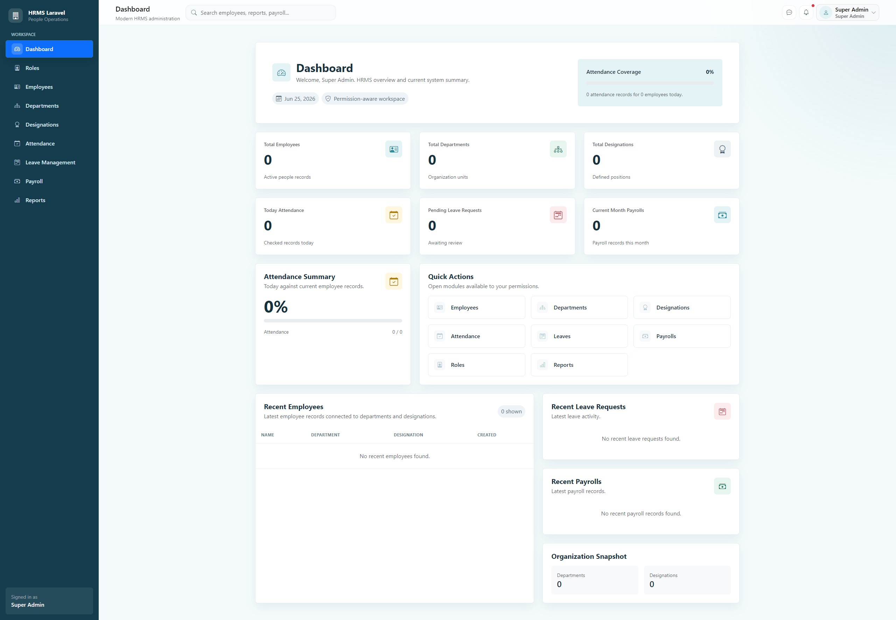
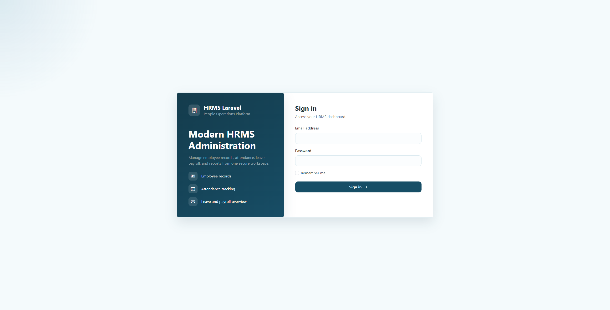

# HRMS Laravel

HRMS Laravel is a production-style Human Resource Management System built with Laravel 12. It demonstrates custom authentication, custom RBAC authorization, core HR module workflows, reporting, dashboard analytics, and automated feature testing in a clean portfolio-ready codebase.

## Tech Stack

- PHP 8.x
- Laravel 12
- MySQL
- Bootstrap 5
- jQuery
- DataTables
- SweetAlert2
- Git & GitHub

## Core Features

- Custom authentication
- Custom role and permission management
- Permission-protected admin panel
- Employee management
- Department management
- Designation management
- Attendance management
- Leave management with approval/rejection workflow
- Payroll management with net salary calculation
- Dashboard overview with real stats
- Read-only reports
- Automated feature tests

## Screenshots

### Dashboard

<p align="center">
  
</p>

### Login

<p align="center">
  
</p>

## Architecture Highlights

- Custom RBAC instead of an external permission package
- Thin controllers
- Form Requests for validation
- Service classes for business logic
- Eloquent relationships between HRMS modules
- Permission-based Blade UI visibility
- Read-only reports separated from CRUD modules
- Business rules covered by tests

## Modules Completed

- [x] Authentication & Authorization
- [x] Role & Permission Management
- [x] Department Management
- [x] Designation Management
- [x] Employee Management
- [x] Attendance Management
- [x] Leave Management
- [x] Payroll Management
- [x] Dashboard
- [x] Reports
- [x] Testing & Quality Review

## Installation

Configure the database connection in `.env` before running migrations.

```bash
composer install
cp .env.example .env
php artisan key:generate
php artisan migrate --seed
php artisan serve
```

## Default Admin Account

Local development seed account:

- Email: `admin@example.com`
- Password: `Password@12345`

Security note: change this credential before production use.

## Testing

Latest test snapshot:

```bash
php artisan test
```

- 76 tests passed
- 280 assertions

## Documentation

- [Database ERD](docs/database/erd.md)
- [Authentication & Authorization](docs/authentication-authorization.md)
- [Testing & Quality Review](docs/testing-quality.md)

## Useful Commands

```bash
php artisan route:list -v --except-vendor
php artisan about
php artisan test
```

## Future Enhancements

- PDF export
- Excel export
- Email notifications
- Employee self-service portal
- API integration
- Advanced payroll rules
- Audit logs

## Production Notes

- Set `APP_DEBUG=false` in production.
- Do not commit `.env`.
- Run config, route, and view cache during deployment.
- Change default admin credentials.
- Plan database backups before using real HR data.

## License

This project is for portfolio and educational purposes unless a `LICENSE` file is added.
