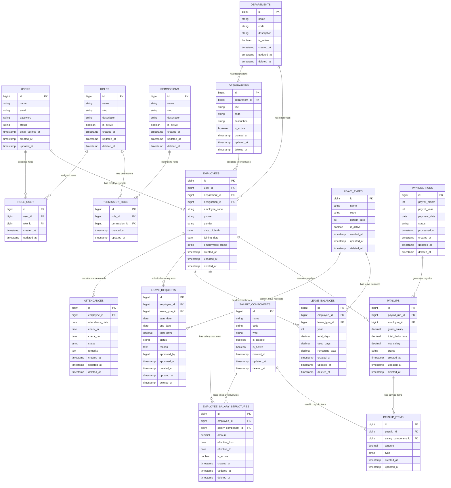

\# HRMS Laravel - Database ERD

\## Purpose

This document describes the Entity Relationship Diagram (ERD) for the HRMS Laravel project.

\## ERD Scope

The ERD covers the core HRMS business modules:

\- Authentication \& Authorization

\- Organization Structure

\- Attendance Management

\- Leave Management

\- Payroll Management

Laravel internal infrastructure tables such as `migrations`, `cache`, and `jobs` are not included in the main business ERD.

\## Architecture Notes

\- `users` table handles authentication identity.

\- `employees` table handles HR/business identity.

\- Role and permission management uses pivot tables.

\- Attendance, leave, and payroll data are separated into transactional tables.

\- Payroll uses an itemized payslip structure for production-style salary breakdown.

\## Text-based ERD

\### Authentication \& Authorization

users many-to-many roles through role\_user  

roles many-to-many permissions through permission\_role

\### Organization Structure

users 1 to 0/1 employees  

departments 1 to many designations  

departments 1 to many employees  

designations 1 to many employees

\### Attendance Management

employees 1 to many attendances

\### Leave Management

employees 1 to many leave\_requests  

leave\_types 1 to many leave\_requests  

employees 1 to many leave\_balances  

leave\_types 1 to many leave\_balances

\### Payroll Management

employees 1 to many employee\_salary\_structures  

salary\_components 1 to many employee\_salary\_structures  

payroll\_runs 1 to many payslips  

employees 1 to many payslips  

payslips 1 to many payslip\_items  

salary\_components 1 to many payslip\_items

\## Mermaid ERD

